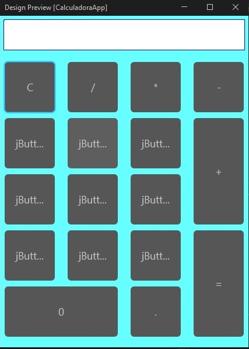
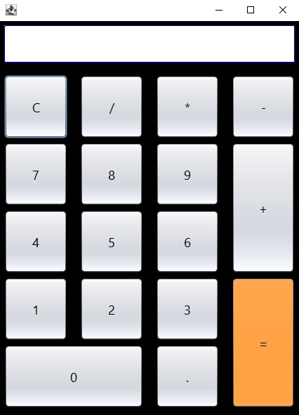
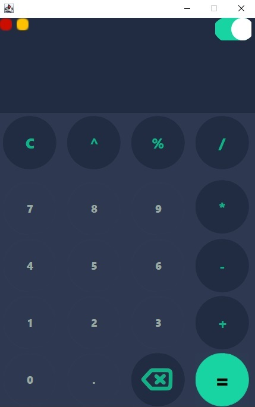

# 📱 Calculadora App - Java GUI

Una calculadora de escritorio desarrollada en Java con interfaz gráfica (Swing), que permite realizar operaciones matemáticas básicas y avanzadas, con soporte para modo claro y oscuro.

---

## 🧾 Descripción general

Esta aplicación de calculadora fue creada como un proyecto de práctica para mejorar el dominio en desarrollo de interfaces gráficas con Java Swing. Se centra en la funcionalidad, el diseño visual moderno y la experiencia de usuario fluida.

---

## ✨ Características

- ✅ Suma, resta, multiplicación y división  
- ✅ Potencia y módulo  
- ✅ Botón para borrar el último dígito ingresado  
- ✅ Botón para borrar todo el contenido  
- ✅ Botones para minimizar y cerrar la aplicación  
- ✅ Cambio de color en los botones al pasar el mouse  
- ✅ Modo claro y modo oscuro integrados  
- ✅ Estética moderna y adaptable  

---

## 🖼️ Capturas de pantalla

### 🔆 Modo Claro  

### 🌙 Modo Oscuro  

### 📥 Versiones

#### Versión Beta 1  

#### Versión Beta 2  

#### Versión Final Modo Claro  

#### Versión Final Modo Oscuro  

---

## 🛠️ Requisitos

- Java JDK 8 o superior  
- NetBeans IDE (opcional, para edición visual de formularios `.form`)  
- Sistema operativo: Windows, Linux o macOS  

---

## 📦 Instalación

1. Clonar este repositorio:

git clone https://github.com/IvoMirkoE22/Calculadora_Java-GUI

2. Abrir el proyecto con NetBeans o cualquier IDE compatible con Java.  
3. Ejecutar la clase `CalculadoraApp.java` para iniciar la aplicación.

---

## 🚀 Uso

- Iniciar la aplicación.  
- Utilizar el teclado o los botones para ingresar operaciones.  
- Cambiar entre modo claro y oscuro.  
- Usar el botón `←` para borrar el último carácter.  
- Usar el botón `C` para borrar todo.  
- Presionar `=` para obtener el resultado.

---

## 🙌 Autor

**Nombre:** Ivo Mirko Elian Narváez  
**Contacto:** ivomirkoelian22@gmail.com

---

## 📃 Licencia

Este proyecto se distribuye bajo la licencia MIT.  
Libre para usar, modificar y distribuir con fines educativos o personales.

---

## 📝 Nota

Esta versión de la app de calculadora es simple, ya que funciona con dos valores y un resultado.  
A medida que continúe aprendiendo Java, iré añadiendo nuevas operaciones y mejoras.  
Para ciertas operaciones investigué cómo resolverlas en internet, lo cual me ayudó a desarrollar habilidades para buscar información técnica.
