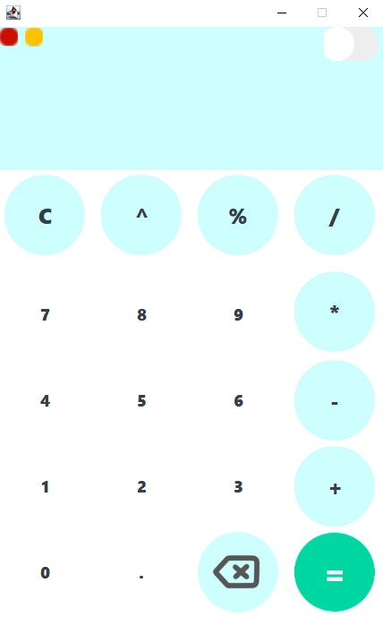
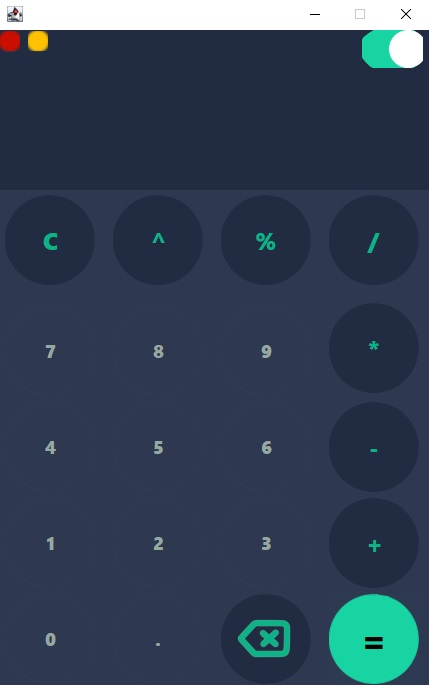
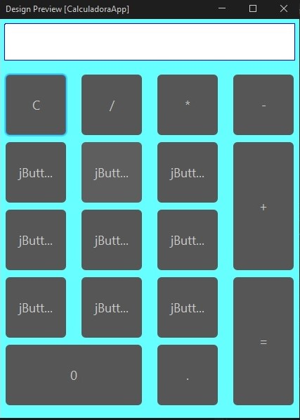
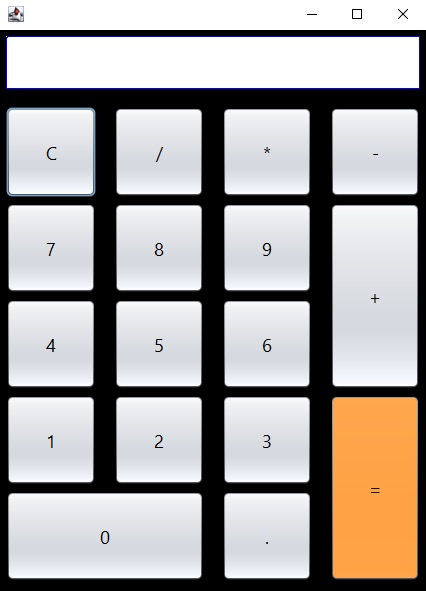
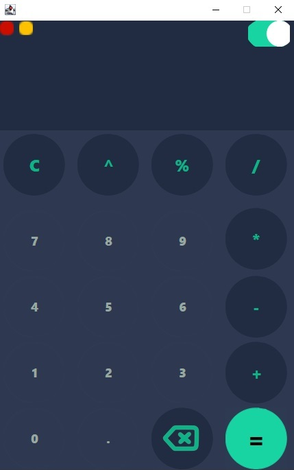

# 📱 Calculator App - Java GUI

A desktop calculator developed in Java using a graphical user interface (Swing), capable of performing basic and advanced mathematical operations, with support for both light and dark modes.

---

## 🧾 Overview

This calculator application was created as a practice project to improve skills in building graphical interfaces with Java Swing. It focuses on functionality, modern visual design, and a smooth user experience.

---

## ✨ Features

- ✅ Addition, subtraction, multiplication, and division  
- ✅ Power and modulo operations  
- ✅ Button to delete the last entered digit  
- ✅ Button to clear all content  
- ✅ Buttons to minimize and close the application  
- ✅ Button hover effects (color change on mouse-over)  
- ✅ Integrated light and dark modes  
- ✅ Modern and responsive design  

---

## 🖼️ Screenshots

### 🔆 Light Mode  


### 🌙 Dark Mode  


### 📥 Versions

#### Beta Version 1  


#### Beta Version 2  


#### Final Version - Light Mode  


#### Final Version - Dark Mode  


---

## 🛠️ Requirements

- Java JDK 8 or higher  
- NetBeans IDE (optional, for editing `.form` files)  
- Operating System: Windows, Linux, or macOS  

---

## 📦 Installation

1. Clone this repository:

```bash
git clone https://github.com/IvoMirkoE22/Calculadora_Java-GUI
```

2. Open the project in NetBeans or any IDE compatible with Java.  
3. Run the `CalculadoraApp.java` class to start the application.

---

## 🚀 Usage

- Launch the application.  
- Use the keyboard or buttons to enter operations.  
- Toggle between light and dark modes.  
- Use the `←` button to delete the last character.  
- Use the `C` button to clear all input.  
- Press `=` to display the result.

---

## 🙌 Author

**Name:** Ivo Mirko Elian Narváez  
**Contact:** ivomirkoelian22@gmail.com

---

## 📃 License

This project is distributed under the MIT License.  
Free to use, modify, and distribute for educational or personal purposes.

---

## 📝 Note

This version of the calculator app is simple and currently supports operations with two values and a single result.  
As I continue learning Java, I plan to add new operations and improvements.  
For some features, I searched online for solutions, which helped me strengthen my ability to find and apply technical information.
